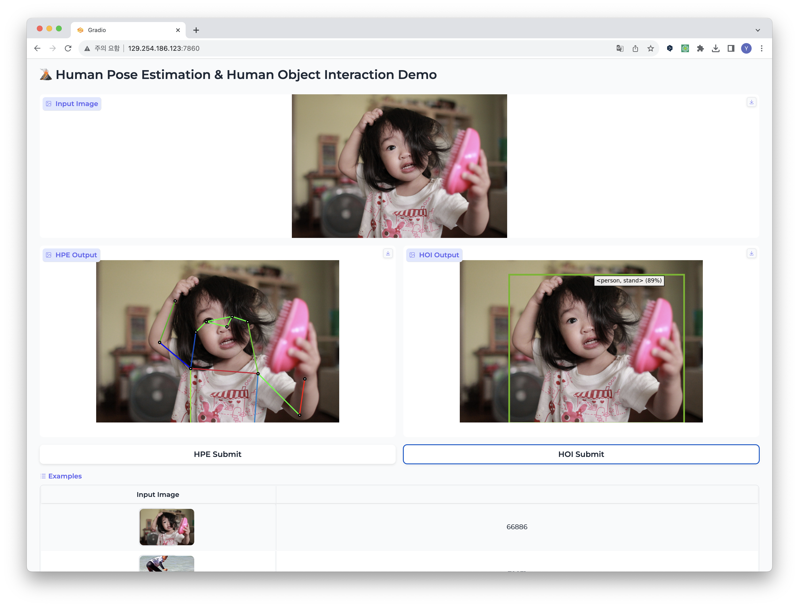

## Human Pose Estimation and Human Object Interaction


---
# HPE

## Overview 


## Installation
```
conda create -n vitpose_uncertainty python=3.9 -y
conda activate vitpose_uncertainty

conda install pytorch==1.10.1 torchvision==0.11.2 torchaudio==0.10.1 cudatoolkit=11.3 -c pytorch -c conda-forge
python -m pip install -r requirements.txt
```

## File tree
```
HPE 
  .
  ├── checkpoints
  ├── data
      └── coco
          ├── annotations
          │   ├── captions_train2017.json
          │   ├── captions_val2017.json
          │   ├── instances_train2017.json
          │   ├── instances_val2017.json
          │   ├── person_keypoints_train2017.json
          │   └── person_keypoints_val2017.json
          ├── images
          │   ├── train2017
          │   ├── val2017
          │   └── val2017.tar.xz
          └── person_detection_results
          │   ├── COCO_test-dev2017_detections_AP_H_609_person.json
          │   └── COCO_val2017_detections_AP_H_56_person.json
  ├── experiments
  ├── lib
  ├── LICENSE
  ├── log
  ├── notebooks
  ├── output
  ├── README.md
  ├── requirements.txt
  ├── tools
  └── wandb
```

## Training
Multi GPU 
```$python3 tools/train_vit.py --cfg experiments/coco/vit/vit_large_uncertainty.yaml --weight {model path} --wandb --gpus 0 1 2 3```

## Trained Model
| Model | AP | Download |
| ------ | ------ | -----|
| ViTPose_huge + uncertainty  | 77.1 | [model](https://drive.google.com/file/d/1YzmJt5aI35a6mbufDkHT3ahvOAKipqcY/view?usp=sharing) |


---

# H-Decoder for Human Ojbect Interaction

## :notes: Overview
<p align="center">
  
</p>

# Installation

```sh
conda create -n hdecoder python=3.9 -y
conda activate hdecoder

pip3 install torch torchvision
python -m pip install 'git+https://github.com/MaureenZOU/detectron2-xyz.git'
python -m pip install -r requirements.txt
```

## Downstream dataset preparation
### V-COCO
First clone the repository of V-COCO from [here](https://github.com/s-gupta/v-coco), and then follow the instruction to generate the file `instances_vcoco_all_2014.json`. Next, download the prior file `prior.pickle` from [here](https://drive.google.com/drive/folders/10uuzvMUCVVv95-xAZg5KS94QXm7QXZW4). Place the files and make directories as follows.
```
HOI
 |─ datasets
 │   └─ v-coco
 |       |─ data
 |       |   |─ instances_vcoco_all_2014.json
 |       |   :
 |       |─ prior.pickle
 |       |─ images
 |       |   |─ train2014
 |       |   |   |─ COCO_train2014_000000000009.jpg
 |       |   |   :
 |       |   └─ val2014
 |       |       |─ COCO_val2014_000000000042.jpg
 |       |       :
 |       |─ annotations
 :       :
```
The annotation file has to be converted to the HOIA format. The conversion can be conducted as follows.
```
PYTHONPATH=datasets/v-coco \
        python convert_vcoco_annotations.py \
        --load_path datasets/v-coco/data \
        --prior_path datasets/v-coco/prior.pickle \
        --save_path datasets/v-coco/annotations
```
Note that only Python2 can be used for this conversion because `vsrl_utils.py` in the v-coco repository shows a error with Python3.

V-COCO annotations with the HOIA format, `corre_vcoco.npy`, `test_vcoco.json`, and `trainval_vcoco.json` will be generated to `annotations` directory.


# Training

Single GPU
```sh
CUDA_VISIBLE_DEVICES=0 python hoi_entry.py train \
            --conf_files configs/hdecoder/vcoco_large.yaml \
            --overrides \
            MODEL.DECODER.HIDDEN_DIM 512 \
            MODEL.ENCODER.CONVS_DIM 512 \
            MODEL.ENCODER.MASK_DIM 512 \
            FP16 True \
            WEIGHT True \
            POSTPROCESS.OFFICIAL.USE False \
            RESUME_FROM checkpoints/xdecoder_focall_last.pt
```

# Evaluation

Single GPU
```sh
CUDA_VISIBLE_DEVICES=0 python hoi_entry.py evaluate \
            --conf_files configs/hdecoder/vcoco_large.yaml \
            --overrides \
            MODEL.DECODER.HIDDEN_DIM 512 \
            MODEL.ENCODER.CONVS_DIM 512 \
            MODEL.ENCODER.MASK_DIM 512 \
            FP16 True \
            DONT_LOAD_MODEL False \
            POSTPROCESS.OFFICIAL.USE True \
            PYLEARN_MODEL checkpoints/vcoco_hdecoder_l.pt
```

# Results
|Visual Feature Extractor| HOI-Decoder | Scenario 1 | Scenario 2 | Download | 
| :--- | :--- | :---: | :---: | :---: |
|X-Decoder (Focal-S)| CDN-S| - | - | [model](https://drive.google.com/file/d/1iObiF0s9aCEL95S13dUdXODImoUtn23P/view?usp=sharing) |
|X-Decoder (Focal-L)| CDN-L| 56.19 | - | [model](https://drive.google.com/file/d/1HYYchCDpdNvDGWqMg7ZHk4R7W-xSX2mI/view?usp=sharing) |

Before downloading checkpoints, create a directory `checkpoints` and save the checkpoint there.
## Citation
```
@article{zou2022xdecoder,
  author      = {Zou*, Xueyan and Dou*, Zi-Yi and Yang*, Jianwei and Gan, Zhe and Li, Linjie and Li, Chunyuan and Dai, Xiyang and Wang, Jianfeng and Yuan, Lu and Peng, Nanyun and Wang, Lijuan and Lee*, Yong Jae and Gao*, Jianfeng},
  title       = {Generalized Decoding for Pixel, Image and Language},
  publisher   = {arXiv},
  year        = {2022},
}

@article{zhang2021mining,
  title={Mining the Benefits of Two-stage and One-stage HOI Detection},
  author={Zhang, Aixi and Liao, Yue and Liu, Si and Lu, Miao and Wang, Yongliang and Gao, Chen and Li, Xiaobo},
  journal={arXiv preprint arXiv:2108.05077},
  year={2021}****
}
```


